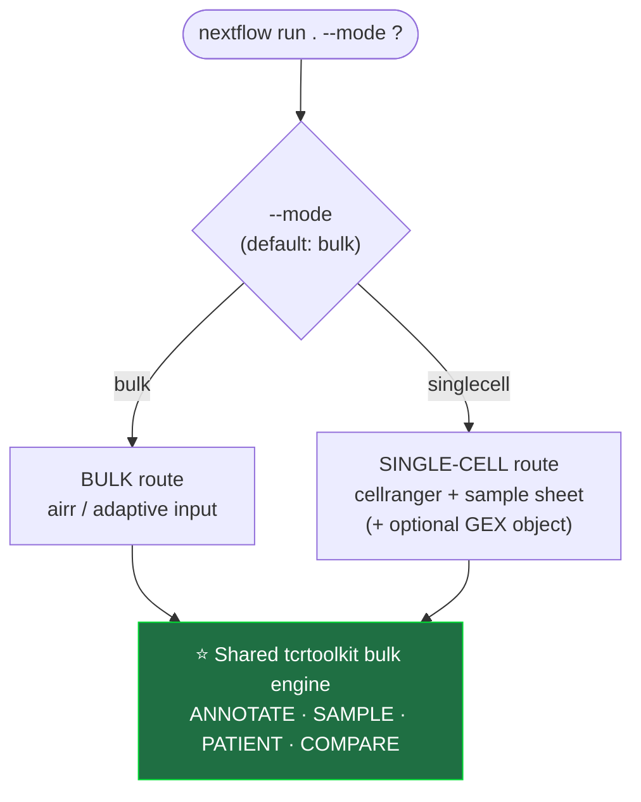
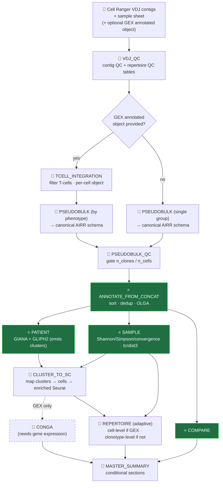
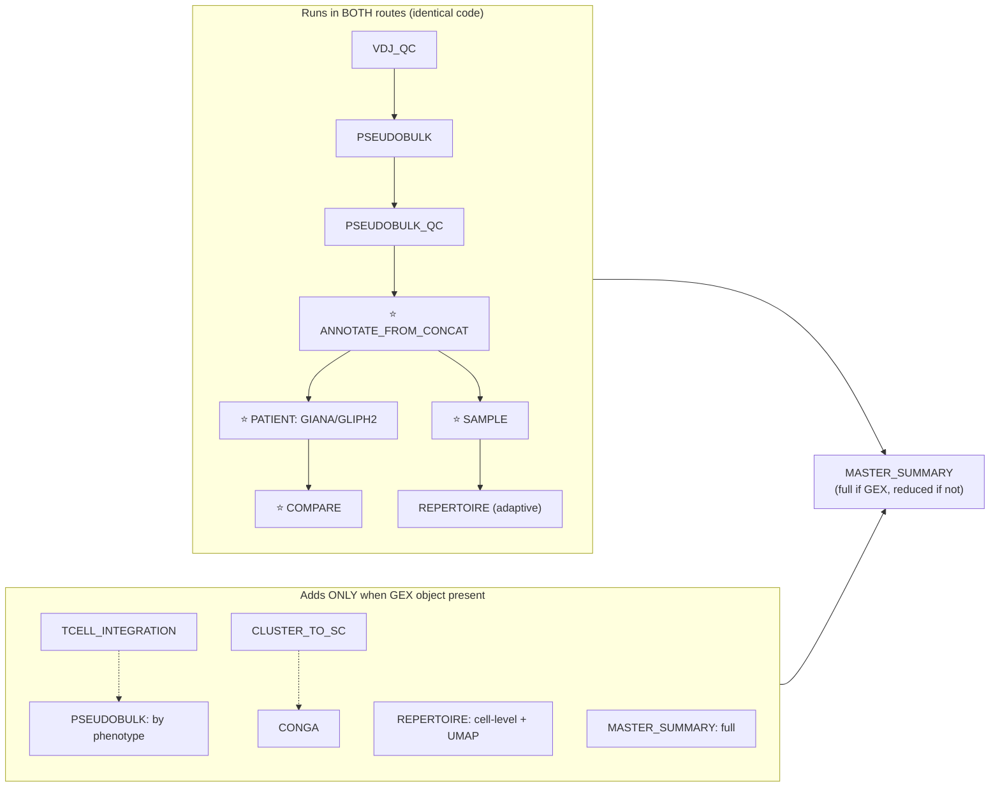
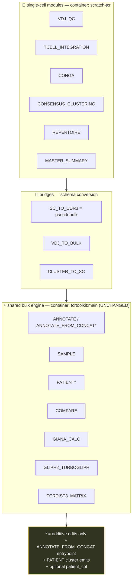
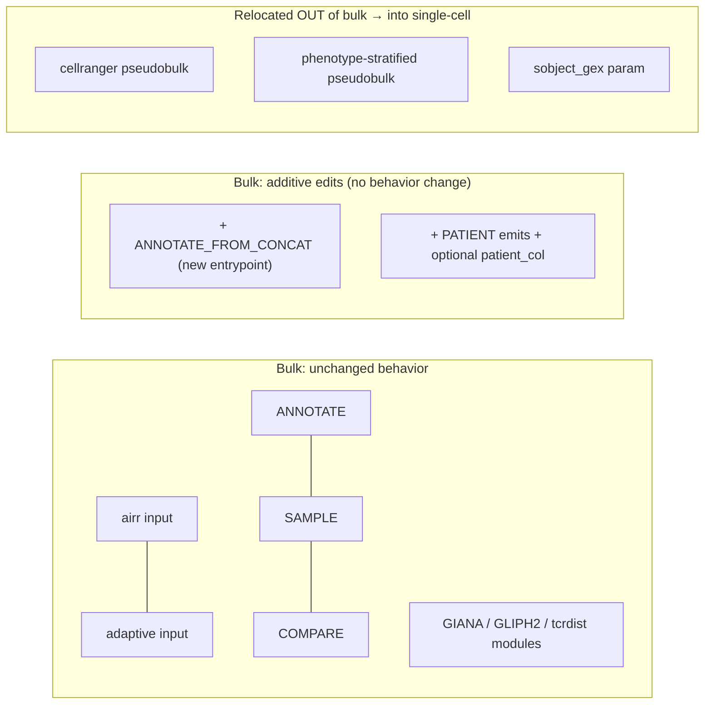

# TCRtoolkit (Integrated) — Design

Merged pipeline: bulk TCR analysis + single-cell TCR analysis sharing one bulk engine.
Full spec in `IMPLEMENTATION_SPEC.md` (same folder). This file is the visual design.

Legend: solid = active path · dashed = skipped when GEX object absent · ⭐ = shared bulk engine
(unchanged) · 🧬 = single-cell-specific · 🔀 = bridge (schema conversion).

---

## 1. Top-level modality dispatch

---

## 2. Full integrated pipeline (the spine)

---

## 3. Two routes overlaid (what runs vs. what is skipped)

---

## 4. Where the code lives (module → source → container)

---

## 5. Bulk-impact summary

