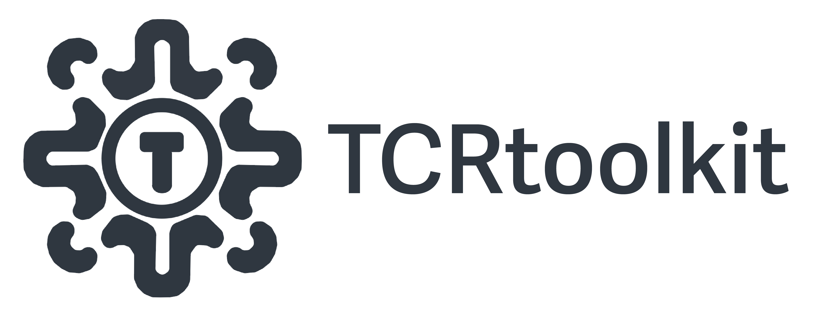

# TCRtoolkit: A T Cell Repertoire Analysis Platform



Thanks for checking out `TCRtoolkit`, the platform for T Cell Repertoire analysis! `TCRtoolkit` is wrapped in NextFlow, written in python, and uses Docker to manage dependencies.

This platform is designed to be a flexible, scalable, and easy-to-use tool for analyzing TCR sequencing data. Because this toolkit is built on NextFlow, it can be run via the command line on any platform, including cloud-based systems like AWS, GCP, and Azure. However, for ease of use, we also plan to provide a web-based interface for running the pipeline via Cirro.

We currently support bulk TCRseq data from Adaptive Biotechnologies, but plan to add single cell and spatial TCRseq datatypes in the near future.

##  Requirements

1. Mamba

Step (1) navigate to https://github.com/conda-forge/miniforge#mambaforge and follow the instructions to install Miniforge3 for your operating system.

2. Nextflow

Nextflow can be used on any POSIX-compatible system (Linux, OS X, WSL). It requires Bash 3.2 (or later) and Java 11 (or later, up to 18) to be installed.

```{bash}
wget -qO- https://get.nextflow.io | bash
chmod +x nextflow
```

The nextflow executable is now available to run on the command line. The executable can be moved to a directory in your $PATH variable so you can run it from any directory.

3. Docker

Docker is a platform to enable `TCRtoolkit` to run in a consistent environment across different systems. Note that Docker images will be automatically downloaded when the pipeline is run. We plan to add support for Singularity containers in the near future.

## Cloning the pipeline

```{bash}
git clone https://github.com/KarchinLab/tcr-toolkit.git
```
# TCRtoolkit: A T Cell Repertoire Analysis Platform


Thanks for checking out `TCRtoolkit`, the platform for T Cell Repertoire analysis! `TCRtoolkit` is wrapped in NextFlow, written in python, and uses Docker to manage dependencies.

This platform is designed to be a flexible, scalable, and easy-to-use tool for analyzing TCR sequencing data. Because `TCRtoolkit` is built on NextFlow, it can be run via the command line locally, on HPC environments, and even cloud-based systems like AWS, GCP, and Azure. In addition, we plan to provide a web-based interface for running the pipeline with no coding required.

We currently support bulk TCRseq data from Adaptive Biotechnologies, but plan to add single cell and spatial TCRseq datatypes in the near future.

##  Requirements

### 1. Nextflow

Nextflow can be used on any POSIX-compatible system (Linux, OS X, WSL). It requires Bash 3.2 (or later) and Java 11 (or later, up to 18) to be installed.

```{bash}
wget -qO- https://get.nextflow.io | bash
chmod +x nextflow
```

The nextflow executable is now available to run on the command line. The executable can be moved to a directory in your $PATH variable so you can run it from any directory, for example: `mv nextflow /usr/local/bin`.

### A note about Docker

Docker is a platform to enable applications to run in a consistent environment across different computing environments. Docker images will be automatically downloaded when the pipeline is run, no need for user installation. We plan to add support for Singularity containers in the near future.

## Running the pipeline

Running `tcrtoolkit` 

```{bash}

```

nextflow run main.nf \
    --project_name=ribas_pd1 \
    --sample_table=/lab/projects1/btc/bulk-tcrseq/assets/ribas_pd1_sample_table.csv \
    --patient_table=/lab/projects1/btc/bulk-tcrseq/assets/ribas_pd1_patient_table.csv \
    --output_dir=<outdir>
