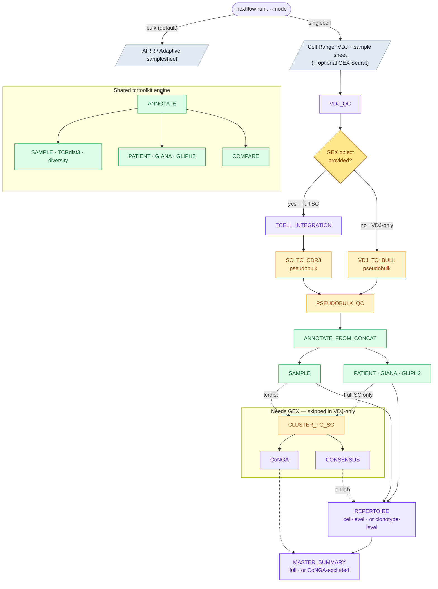
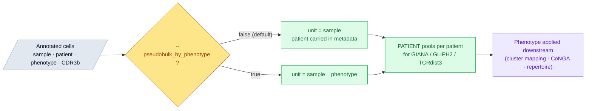

# TCRtoolkit

A unified Nextflow DSL2 pipeline for T-cell receptor (TCR) repertoire analysis that handles both
**bulk** and **single-cell** TCR data under a single entry point.

The pipeline integrates two complementary engines that share **one** bulk analysis core:

- **Bulk engine** — clonotype statistics, generation probabilities (OLGA), GIANA & GLIPH2 motif
  clustering, TCRdist3 distances, convergence, and antigen specificity.
- **Single-cell engine** — VDJ QC, T-cell integration with an annotated GEX object, cluster
  mapping back onto cells, CoNGA, consensus clustering, and repertoire profiling.

Single-cell data is *pseudobulked* into clonotype tables and run through the **exact same** bulk
code as bulk input — so GIANA/GLIPH2/TCRdist3 and every diversity metric are computed once and are
directly comparable across modalities.

---

## Contents

- [Architecture](#architecture)
- [Analysis modes](#analysis-modes---mode)
- [Pseudobulk pooling](#pseudobulk-pooling)
- [Requirements & containers](#requirements--containers)
- [Quick start](#quick-start)
- [Parameters](#parameters)
- [Route coverage](#route-coverage)
- [Testing](#testing)
- [Repository layout](#repository-layout)

---

## Architecture

`--mode` selects the modality (default `bulk`). The single-cell route auto-detects two sub-modes
from whether an annotated GEX Seurat object is supplied.

> **Legend** — 🟩 `tcrtoolkit` module (shared engine) · 🟪 `SCRATCH` single-cell module ·
> 🟧 `bridge` (SC → bulk glue) · ⬜ input.


```mermaid
flowchart TD
    START(["nextflow run . --mode"])
    START -->|"bulk (default)"| BIN[/"AIRR / Adaptive samplesheet"/]
    START -->|singlecell| SIN[/"Cell Ranger VDJ + sample sheet<br/>(+ optional GEX Seurat)"/]

    %% ---- shared bulk engine ----
    BIN --> ANN
    subgraph ENG["Shared tcrtoolkit engine"]
      direction TB
      ANN["ANNOTATE"] --> SAM["SAMPLE · TCRdist3 · diversity"]
      ANN --> PAT["PATIENT · GIANA · GLIPH2"]
      ANN --> CMP["COMPARE"]
    end

    %% ---- single-cell head ----
    SIN --> VQ["VDJ_QC"]
    VQ --> GEX{"GEX object<br/>provided?"}
    GEX -->|"yes · Full SC"| TI["TCELL_INTEGRATION"]
    TI --> SCB["SC_TO_CDR3<br/>pseudobulk"]
    GEX -->|"no · VDJ-only"| VB["VDJ_TO_BULK<br/>pseudobulk"]
    SCB --> PQ["PSEUDOBULK_QC"]
    VB --> PQ
    PQ --> AF["ANNOTATE_FROM_CONCAT"]
    AF --> SAM2["SAMPLE"]
    AF --> PAT2["PATIENT · GIANA · GLIPH2"]

    %% ---- GEX-gated cell-level tail ----
    PAT2 -. "Full SC only" .-> CT["CLUSTER_TO_SC"]
    SAM2 -. tcrdist .-> CT
    subgraph GATED["Needs GEX — skipped in VDJ-only"]
      direction TB
      CT --> CG["CoNGA"]
      CT --> CN["CONSENSUS"]
    end

    %% ---- reports run in BOTH routes ----
    SAM2 --> RE["REPERTOIRE<br/>cell-level · or clonotype-level"]
    PAT2 --> RE
    CN -. enrich .-> RE
    RE --> MS["MASTER_SUMMARY<br/>full · or CoNGA-excluded"]
    CG -.-> MS

    classDef tk fill:#dcfce7,stroke:#16a34a,color:#166534;
    classDef sc fill:#ede9fe,stroke:#7c3aed,color:#5b21b6;
    classDef br fill:#fef3c7,stroke:#d97706,color:#92400e;
    classDef inp fill:#e2e8f0,stroke:#94a3b8,color:#0f172a;
    classDef gate fill:#fde68a,stroke:#b45309,color:#92400e;
    class ANN,SAM,PAT,CMP,AF,SAM2,PAT2 tk;
    class VQ,TI,CG,CN,RE,MS sc;
    class SCB,VB,PQ,CT br;
    class BIN,SIN inp;
    class GEX gate;
```

**Reading the gate:** without a GEX object (VDJ-only), the dashed box —
**CLUSTER_TO_SC → CoNGA / CONSENSUS** — is skipped (CoNGA needs gene-expression data; cluster
mapping needs cells). **REPERTOIRE and MASTER_SUMMARY still run** in both routes: cell-level & full
when a GEX object is present, clonotype-level repertoire & a CoNGA-excluded summary when it is not.

---

## Analysis modes (`--mode`)

### Bulk mode (default)

Bulk repertoire analysis. Input format is set via `--input_format`:

| Format | Description |
|---|---|
| `airr` | AIRR-compliant tab-separated files |
| `adaptive` | Adaptive Biotechnologies output files |

```bash
nextflow run . --samplesheet samplesheet.csv --input_format airr
```

### Single-cell mode

Single-cell TCR analysis from Cell Ranger VDJ output, with an optional annotated GEX Seurat object.

| Route | Trigger | Pipeline |
|---|---|---|
| **Full SC** | `--input_annotated_object` given | VDJ_QC → T-cell integration → pseudobulk → QC → shared engine → CLUSTER_TO_SC → CoNGA → consensus → repertoire → master summary |
| **VDJ-only** | no GEX object | VDJ_QC → pseudobulk (from contigs) → QC → shared engine → clonotype-level repertoire → CoNGA-excluded master summary |

```bash
# VDJ-only
nextflow run . --mode singlecell \
    --input_vdj_contigs 'cellranger/*/outs' \
    --sample_sheet sc_samplesheet.csv

# Full single-cell (adds the annotated Seurat object)
nextflow run . --mode singlecell \
    --input_vdj_contigs 'cellranger/*/outs' \
    --sample_sheet sc_samplesheet.csv \
    --input_annotated_object annotated_tcells.rds
```

---

## Pseudobulk pooling

Single cells are collapsed into per-unit clonotype tables **before** the shared engine runs. The
default pools **by sample**; `patient` is carried as metadata so `PATIENT` pools **per patient**
for clustering, and cell-type (phenotype) is applied **downstream**.


```mermaid
flowchart LR
    C[/"Annotated cells<br/>sample · patient · phenotype · CDR3b"/]
    C --> D{"--pseudobulk_by_phenotype ?"}
    D -->|"false (default)"| E["unit = sample<br/>patient carried in metadata"]
    D -->|"true"| F["unit = sample__phenotype"]
    E --> G["PATIENT pools per patient<br/>for GIANA / GLIPH2 / TCRdist3"]
    F --> G
    G --> H["Phenotype applied downstream<br/>(cluster mapping · CoNGA · repertoire)"]

    classDef inp fill:#e2e8f0,stroke:#94a3b8,color:#0f172a;
    classDef gate fill:#fde68a,stroke:#b45309,color:#92400e;
    classDef tk fill:#dcfce7,stroke:#16a34a,color:#166534;
    classDef sc fill:#ede9fe,stroke:#7c3aed,color:#5b21b6;
    class C inp; class D gate; class E,F,G tk; class H sc;
```

**Why not pre-split by phenotype?** Splitting each sample by cell-type shreds the repertoire — many
units fall below the QC floor, and clusters that span cell states (the same clone in effector vs
memory) get cut in two. Pooling the full repertoire per patient preserves statistical power;
phenotype then enters as *association*. A secondary per-cell-type view is opt-in via
`--pseudobulk_by_phenotype true` (under-powered `{sample}__{phenotype}` units are dropped by the QC
gate).

---

## Requirements & containers

1. **Nextflow** (POSIX system, Bash 3.2+, Java 11–18):
   ```bash
   wget -qO- https://get.nextflow.io | bash
   ```
2. **Docker** — `docker.enabled = true` is set by default. Two images run the pipeline,
   assigned **per-process**:

| Container | Runs |
|---|---|
| `ghcr.io/karchinlab/tcrtoolkit:main` (`--container`) | Bulk & shared engine — including **GIANA, GLIPH2, TCRdist3** (tcrtoolkit tools), OLGA, diversity stats, and the pandas bridges |
| `syedsazaidi/scratch-tcr` (`--sc_container`) | Single-cell R / Seurat / scanpy steps — VDJ QC, T-cell integration, CoNGA, consensus, repertoire, master summary, cluster mapping |

```bash
docker pull syedsazaidi/scratch-tcr
docker pull ghcr.io/karchinlab/tcrtoolkit:main
```

---

## Quick start

Non-default parameters are best supplied via a `-params-file` so numeric/boolean values are not
cast to strings.

```bash
# Bulk — uses the bundled minimal example
nextflow run . --samplesheet tests/test_data/minimal-example/samplesheet.csv --input_format airr

# Single-cell — edit the template first
nextflow run . -params-file params_singlecell.yml
```

Useful flags: `-resume` (reuse cached steps), `-with-report report.html -with-trace` (execution +
resource report).

---

## Parameters

**Bulk mode**

| Parameter | Default | Description |
|---|---|---|
| `--samplesheet` | — | Path or URL to sample sheet CSV |
| `--outdir` | `out` | Output directory |
| `--input_format` | `airr` | `airr` or `adaptive` |
| `--workflow_level` | `sample,compare` | `sample`, `patient`, `compare` (comma-separated) |
| `--use_gliph2` | `true` | Enable GLIPH2 CDR3 motif clustering |

**Single-cell mode (`--mode singlecell`)**

| Parameter | Default | Description |
|---|---|---|
| `--input_vdj_contigs` | — | Cell Ranger VDJ output glob (required) |
| `--sample_sheet` | — | SC sample sheet CSV — columns `sample`, `path` (+ `patient_id`, …) |
| `--input_annotated_object` | — | Optional annotated GEX Seurat `.rds`; present → full-SC route |
| `--pseudobulk_by_phenotype` | `false` | Stratify pseudobulk into `{sample}__{phenotype}` units |
| `--pseudobulk_qc_min_clones` | `25` | Min unique clonotypes per unit (QC gate) |
| `--pseudobulk_qc_min_cells` | `50` | Min cells per unit (QC gate) |
| `--pseudobulk_qc_mode` | `drop` | `drop` = skip failing units · `hard_stop` = abort |
| `--patient_col` | `patient_id` | Metadata key used to pool units per patient |
| `--sc_container` | `syedsazaidi/scratch-tcr:latest` | Container for cell-level single-cell steps |
| `--run_conga` / `--run_consensus` / `--run_repertoire` / `--run_master_summary` | `true` | Toggle single-cell report stages |

**Resources**

| Parameter | Default | Description |
|---|---|---|
| `--max_memory` | `768.GB` | Upper cap on any single process's memory request |
| `--max_cpus` | `192` | Upper cap on CPUs |

Single-cell cell-level steps reserve ~60 GB each → plan for **~64 GB RAM** (128 GB comfortable) for
single-cell mode; bulk mode is lighter (~16–64 GB). Tune in `conf/base.config`.

---

## Route coverage

| Stage | Full SC · GEX present | VDJ-only · no GEX |
|---|:---:|:---:|
| VDJ QC → pseudobulk → QC gate | ✅ | ✅ |
| OLGA · GIANA · GLIPH2 · TCRdist3 · diversity | ✅ | ✅ |
| CLUSTER_TO_SC · CoNGA · CONSENSUS | ✅ | ❌ skipped (needs GEX) |
| Repertoire analysis | ✅ cell-level | ✅ clonotype-level |
| Master summary | ✅ full | ✅ CoNGA-excluded |

---

## Testing

Component tests use [nf-test](https://www.nf-test.com/) and run on the host (no images needed):

```bash
nf-test test tests/modules/bridges/sc_to_cdr3.nf.test \
             tests/modules/bridges/vdj_to_bulk.nf.test \
             tests/modules/local/pseudobulk_qc/pseudobulk_qc.nf.test
```

Bulk module tests run inside the Docker container (`docker.enabled = true`).

---

## Repository layout

```
main.nf                          --mode dispatcher (bulk | singlecell)
workflows/
  tcrtoolkit.nf                  bulk workflow (shared engine)
  singlecell.nf                  single-cell orchestrator (both routes)
subworkflows/
  local/                         shared engine: annotate, sample, patient, compare,
                                   report, pseudobulk_qc  (+ ANNOTATE_FROM_CONCAT)
  scratch/                       single-cell: vdj_qc, tcell_integration, conga,
                                   consensus_clustering, repertoire, master_summary
  bridges/                       sc_to_cdr3, vdj_to_bulk, cluster_to_sc
modules/
  local/                         tcrtoolkit modules (incl. GIANA, GLIPH2, TCRdist3)
  scratch/                       single-cell module implementations + .qmd reports
  bridges/                       sc_to_cdr3, vdj_to_bulk, cluster_to_sc,
                                   sc_sample_stats, bulk_to_export
bin/                             analysis scripts (Python / R)
conf/base.config                 per-process resources + SC container routing
notebooks/                       bulk Quarto report templates
```

For the full design rationale and change log, see `DESIGN.md` and `IMPLEMENTATION_SPEC.md`.
